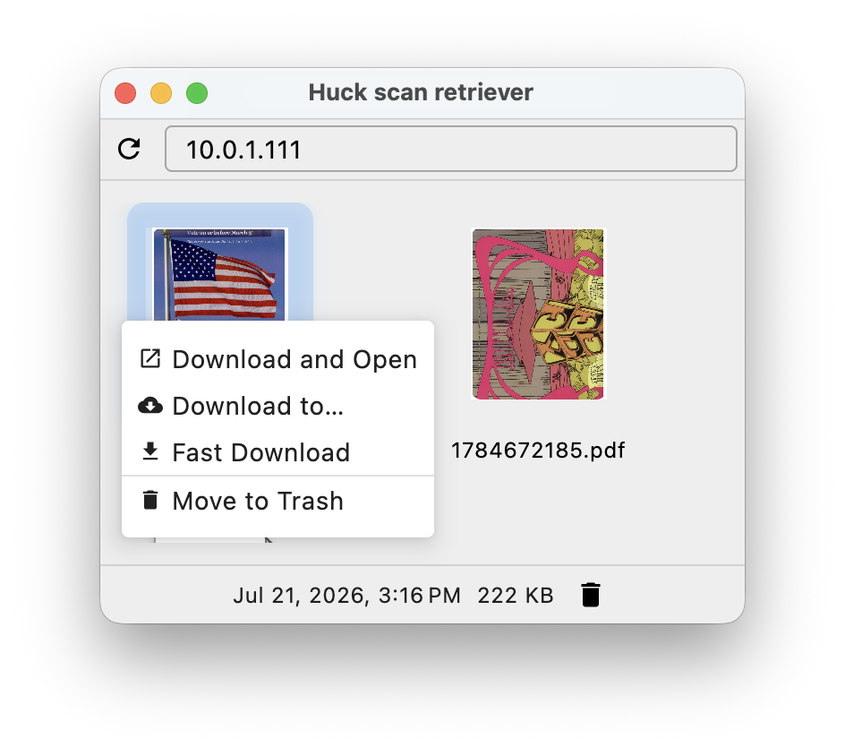

# Huck scan retriever

We now have [tools](https://github.com/woodie/lambada/) to get files from
an old scanner (that requires an open relay) but downloading files over HTTP
with a web browser can be a drag (with steps to keep unsafe documents off your
computer) and setting up HTTPS on your internal network is an absolute pain.
Finally, serving files with Samba can work but it can be slow and awkward to use.

Fear not, now we have the Huck scan retriever for Windows.
This minimal Kotlin/Compose Desktop app is just what we need for browsing and
downloading scans through [lambada](https://github.com/woodie/lambada)
(created with Go) or [scandalous](https://github.com/woodie/scandalous)
(created with Ruby). The main screen is similar to a Samba share but much
faster and easier to use.

On launch, huck asks for a hostname or IP address (e.g.
`10.0.1.111`) and remembers it for next time.
If the server can't be reached, it shows an inline error and lets you
retry or change the server. Once connected, click a thumbnail to see its
date and size in the footer, and double-click to save it -- a native
Save panel opens with the scan's name and `~/Downloads` already
selected, so confirming as-is saves it there just like before, but
renaming it or picking a different folder is just as easy. Either way,
once it's saved it opens in whatever app handles PDFs, the same as
double-clicking a file on a mounted network share. While it saves
you'll see a brief "Saving…" note, and once it's done the footer reads
"File … saved." and stays that way until you click something else, so
it's hard to miss.

## Compatibility

huck talks `GET /files.json` and expects a `path` field per entry.
Requires a matching server:
[scandalous](https://github.com/woodie/scandalous) 0.3.0+ or
[lambada](https://github.com/woodie/lambada)'s lambada-web 2.0.0+.

## Development

Building from source and the project layout moved to
[docs/DEVELOPER.md](docs/DEVELOPER.md).

## Install

### Windows

Grab the latest `.msi` from the
[Releases page](https://github.com/woodie/huck/releases/latest) and
double-click it -- Next, Next, Finish, like any other Windows installer.
The `.msi` isn't code-signed yet, so Windows SmartScreen may show an
"Unknown publisher" warning on first run -- click **More info** then
**Run anyway** to continue.

### macOS

Use [`zouk`](https://github.com/woodie/zouk) instead -- the native Swift
version of this same app.
