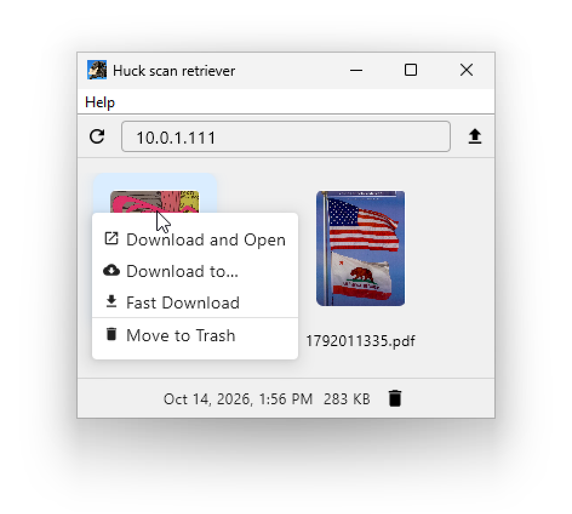

# Huck scan retriever

[lambada](https://github.com/woodie/lambada) serves the scans from an old
scanner (one that needs an open relay) over WebDAV, so a web browser, File Explorer
and other WebDAV apps can all reach them. Each comes with extra steps, though:
browsers warn about every download over plain HTTP, and mounting the folder
means connect-as-guest dialogs and remembering to disconnect.

Fear not, now we have the Huck scan retriever for Windows: the optimized
experience for downloading scans. Set it up once with your Pi's address, and
from then on it opens straight to your scans as a grid of thumbnails, with no
warnings or dialogs to click through. The main screen is similar to a mapped
network drive, but much faster and easier to use.

On launch, huck asks for a hostname or IP address (e.g.
`10.0.1.111`) and remembers it for next time.
If the server can't be reached, it shows an inline error and lets you
retry or change the server. Once connected, click a thumbnail to see its
date and size in the footer, and double-click to save it -- a native
Save panel opens with the scan's name and `~/Downloads` already
selected, so confirming as-is saves it there just like before, but
renaming it or picking a different folder is just as easy. Either way,
once it's saved it opens in whatever app handles PDFs, the same as
double-clicking a file on a mounted network share. While it saves
you'll see a brief "Saving…" note, and once it's done the footer reads
"File … saved." and stays that way until you click something else, so
it's hard to miss.

To upload, drag files onto the window, or click the upload button at the
right of the toolbar and pick them. Each file can be up to 25 MB; if one
with the same name is already there, huck asks before replacing it.

## Compatibility

huck works with any WebDAV folder that allows guest access: it lists the
folder with a WebDAV `PROPFIND`, downloads or deletes each file at its own
address, and uploads with `PUT`. Enter the folder's address, like `10.0.1.111` or
`10.0.1.111:8081/scans/`. [lambada](https://github.com/woodie/lambada)'s
nginx config (`service/lambada.nginx.conf`) is one such server.

## Development

Building from source and the project layout moved to
[docs/DEVELOPER.md](docs/DEVELOPER.md).

## Install on Windows

Grab the latest `.msi` from the
[Releases page](https://github.com/woodie/huck/releases/latest) and
double-click it -- Next, Next, Finish, like any other Windows installer.
The `.msi` isn't code-signed yet, so Windows SmartScreen may show an
"Unknown publisher" warning on first run -- click **More info** then
**Run anyway** to continue.
For macOS, try [Zouk](https://github.com/woodie/zouk).
